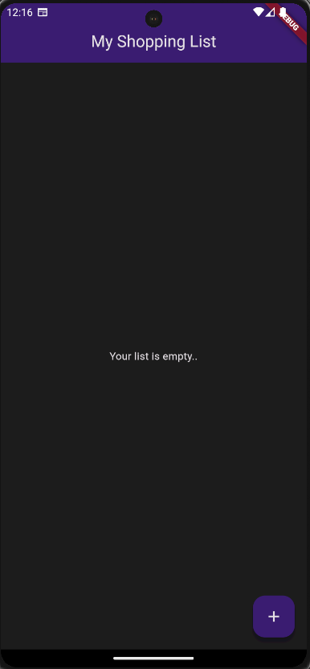
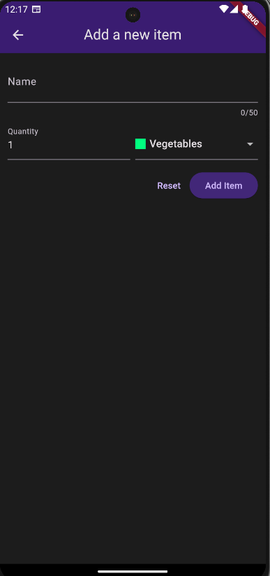

# Shopping List App

A Flutter application for managing a shopping list. Users can add items with names, quantities, and categories to the list. The data is stored in a Firebase Realtime Database.

## Table of Contents

- [Features](#features)
- [Screenshots](#screenshots)
- [Getting Started](#getting-started)
  - [Prerequisites](#prerequisites)
  - [Installation](#installation)
  - [Running the App](#running-the-app)
- [Usage](#usage)
- [Firebase Configuration](#firebase-configuration)
- [Built With](#built-with)

## Features

- Add new items to the shopping list.
- Specify the name, quantity, and category of each item.
- Items are stored in a Firebase Realtime Database.
- Remove items from the Firebase Realtime Database.

## Screenshots




## Getting Started

### Prerequisites

- Flutter SDK: [installation guide](https://flutter.dev/docs/get-started/install)
- Android Studio: [installation guide](https://developer.android.com/studio)
- Firebase account: [Firebase console](https://console.firebase.google.com/)

### Installation

1. Clone the repository
   ```sh
   git clone https://github.com/dawid3056/shopping-list-app.git
   cd shopping-list-app

2. Install dependencies
    ```sh
    flutter pub get

### Running the App

1. Ensure you have an emulator or a physical device connected.

2. Run the app
    ```sh
    flutter run

## Usage 

After cloning the repository and installing the dependencies, you can start the app on your emulator or physical device. The app will open to the main screen where you can view your shopping list and add new or remove existing items.

## Firebase Configuration

1. Set up Firebase for both Android and iOS. Follow the instructions provided in the [Firebase setup guide](https://firebase.flutter.dev/docs/overview/).

2. Obtain the Firebase Realtime Database URL:
 - Go to the "Realtime Database" section in the Firebase Console.
 - At the top of the page, you will see a URL. This is your Firebase Realtime Database URL.

3. Create a `.env` file in the root of the project and add your Firebase keys:
   ```env
   FIREBASE_DATABASE_URL=your_firebase_database_url

4. Add the `.env` file to your `.gitignore` to ensure it is not pushed to the repository.

## Built With

- [Flutter](https://flutter.dev/) - The UI framework used to build the application.
- [Firebase](https://firebase.google.com/) - Backend services including database, and storage.


